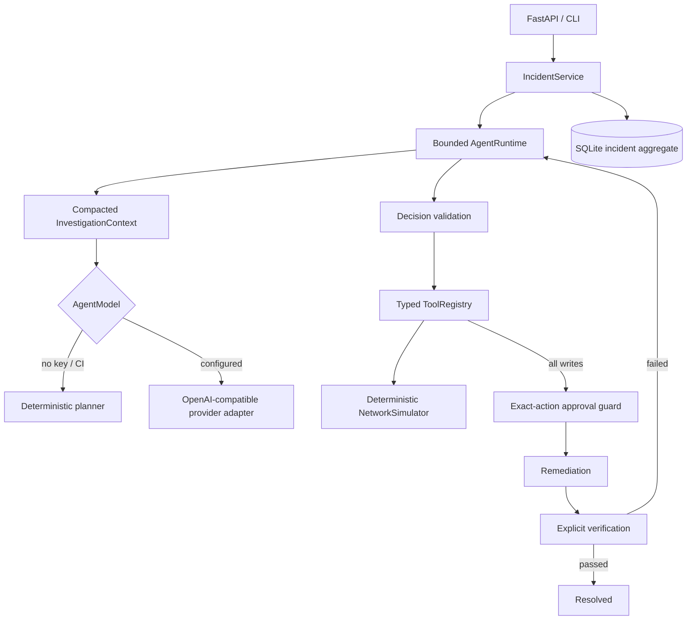

# Relay — Agentic Network Incident Response

Relay is a typed Python/FastAPI system for bounded, tool-driven network investigation and human-approved remediation. Milestone 2 adds a provider-independent agent runtime while retaining the deterministic Milestone 1 workflow and a no-key deterministic planner for tests and local demos.

Relay stores explicit operational artifacts only: plans, model decisions, tool calls, structured observations, evidence, hypotheses and their revisions, approvals, remediation attempts, verification, summaries, and event history. It never stores or exposes hidden chain-of-thought. Models cannot invoke a shell or arbitrary code; they can only select registered tools with validated Pydantic arguments.

## Implemented architecture



The domain and API contain no provider SDK types. `AgentModel.decide_next_action(InvestigationContext) -> AgentDecision` is async, easy to script in tests, and produces one of six structured actions: run a tool, request evidence, update a hypothesis, propose remediation, declare resolved, or declare blocked. Provider timeouts and malformed responses block a run safely; deterministic fallback remains the default.

The runtime reloads the persisted incident, builds a bounded context using recent calls/evidence plus the running summary, validates each decision, and stops at remediation, resolution, blocked status, or the configured step limit. Identical calls are bounded. Tool validation, unavailable tools, retryable timeouts, retry counts, duration, error category, and timestamps are observable. A run ID ties actions and structured events together.

## Investigation and hypothesis lifecycle

```text
OPEN → INVESTIGATING → AWAITING_APPROVAL → REMEDIATING → VERIFYING → RESOLVED
                         ↑                                  │
                         └──── continue investigation ──────┘
```

Hypotheses are durable first-class objects with suspected component, confidence, supporting and contradicting evidence IDs, `ACTIVE`/`REJECTED`/`CONFIRMED` status, and revision history. Long runs retain a concise investigation summary instead of passing the database or unbounded history to a model.

Every tool is classified `READ_ONLY`, `LOW_RISK_WRITE`, or `HIGH_RISK_WRITE`. Read-only investigation is autonomous. Every write is blocked centrally until approval names the incident ID, remediation ID, approver, exact tool, and exact arguments. A SHA-256 fingerprint binds those values, so changed arguments, another remediation, or another incident invalidate approval. Approval and execution status are persisted.

Remediation never implies recovery. Relay verifies with scenario-relevant ping, traceroute, TCP, DNS, or loss checks. Failed verification is recorded and returns the incident to `INVESTIGATING` within the remaining operator-driven lifecycle.

## Deterministic scenarios and tools

Six reproducible scenarios have known evaluation expectations without placing the answer in `InvestigationContext`:

| Scenario | Fault | Primary diagnostics | Approved remediation |
| --- | --- | --- | --- |
| `interface-disabled` | disabled branch uplink | ping, trace, interface, logs/config | enable interface |
| `incorrect-route` | wrong static next hop | trace, route table | restore route |
| `acl-block` | TCP/443 deny while ping works | TCP test, ACL rules | disable bad deny rule |
| `dns-failure` | incorrect service record | ping and DNS resolution | restore DNS record |
| `degraded-link` | high latency and packet loss | link metrics and packet loss | repair link |
| `config-drift` | forwarding differs from baseline | config comparison/change history | restore baseline |

Read tools include `ping`, `traceroute`, `resolve_dns`, `test_tcp_connection`, `get_acl_rules`, `get_link_metrics`, `get_packet_loss`, `compare_config_to_baseline`, recent changes, routes, interfaces, logs, config, and topology. Mutation tools are purpose-built and typed; there is no generic command executor.

## Run locally

Python 3.12+:

```bash
make install
make run
```

Or use `docker compose up --build`. The API is at `http://localhost:8000` and OpenAPI at `/docs`.

Relay needs no API key. Defaults in `.env.example` select the deterministic planner. For an OpenAI-compatible Responses API, set:

```dotenv
RELAY_AGENT_PROVIDER=openai-compatible
RELAY_AGENT_API_KEY=your-secret
RELAY_AGENT_MODEL=gpt-5-mini
RELAY_AGENT_BASE_URL=https://api.openai.com/v1
```

Timeout, step, repeated-call, and retry limits are configurable with the remaining `RELAY_` variables in `.env.example`. Never commit `.env` or credentials. If provider selection is configured without a key, Relay stays deterministic.

## CLI demo

After `make install`:

```bash
relay create --scenario incorrect-route
relay investigate <incident-id>
relay show <incident-id>
relay approve <incident-id> <remediation-id> --by alice
relay show <incident-id>
```

`investigate` stops at `AWAITING_APPROVAL`; a direct write through the registry remains blocked. `approve` executes only the matching proposal and then verifies recovery. `continue` resumes an incident in a resumable state.

## API

Milestone 1 endpoints remain available, including `POST /incidents/{id}/investigate` and `POST /incidents/{id}/approve-remediation`. New agent endpoints are:

| Method | Path | Purpose |
| --- | --- | --- |
| POST | `/incidents/{id}/agent/run` | Start a bounded agent run |
| POST | `/incidents/{id}/agent/continue` | Resume investigation |
| GET | `/incidents/{id}/investigation` | Full explicit state and events |
| GET | `/incidents/{id}/actions` | Structured decision history |
| GET | `/incidents/{id}/hypotheses` | Hypotheses and revision history |
| GET | `/incidents/{id}/remediations` | Proposal/attempt history |
| POST | `/incidents/{id}/remediations/{rid}/approve` | Approve the exact proposal |
| GET | `/incidents/{id}/verification` | Latest recovery evidence/result |

Example approval body:

```json
{"remediation_id":"<same-remediation-id>","approved_by":"alice@example.com"}
```

## Evaluation and quality

Run all six scenarios with the real deterministic planner:

```bash
python -m relay.eval --output evaluation-results.json
```

The command prints a human summary and writes structured JSON. Metrics cover root-cause and remediation accuracy, actual resolution, safety violations, diagnostic calls, decision steps, injected timeout recovery, and repeated actions. It never invents LLM scores when no provider is configured; CI uses deterministic/scripted models.

```bash
make test
make lint
make typecheck
make check
```

Tests retain the 14 Milestone 1 cases and add deterministic integration coverage for every scenario, scripted model/provider failure behavior, bounded repeats, retry metadata, hypothesis updates, exact approval isolation, unauthorized writes, failed verification re-entry, successful resolution, and agent API surfaces. No test calls a live model.

## Current limitations and future roadmap

Implemented now: one stateful bounded investigator, deterministic simulator, optional OpenAI-compatible structured provider adapter, SQLite aggregate persistence, typed tools, exact human approval, explicit verification, CLI/API demos, events, and deterministic evaluation.

Future work—not presented as complete—includes durable simulator/device-adapter state across process restarts, authenticated role-based approval signatures, background workers and concurrency control, richer provider adapters and prompt/version telemetry, calibrated confidence evaluation, production tracing, real network integrations, and specialist/multi-agent experiments.
