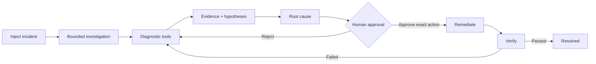
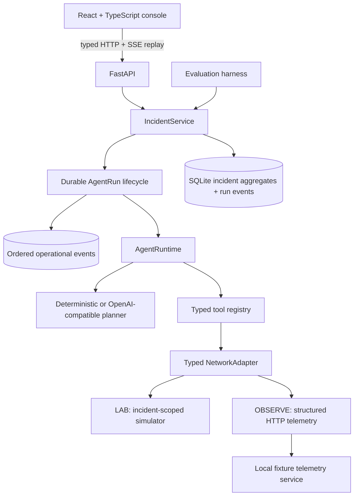

# Relay

> Relay is an agentic network incident response platform that autonomously investigates connectivity failures, gathers evidence through diagnostic tools, identifies root causes, proposes human-approved remediation, and verifies recovery.

Relay combines an incident-isolated deterministic network laboratory, read-only external telemetry, durable agent runs, a replayable event stream, and an interactive NOC console. Every structured plan, tool call, observation, hypothesis revision, approval, write, and recovery check is stored and visible; hidden model reasoning is not.

## Problem and product workflow

Network incidents are diagnosed through reachability tests, path inspection, configuration checks, and human handoffs. An opaque AI answer is not operationally useful. Relay makes the investigation legible and keeps changes behind an exact-action approval boundary.



The console has real Overview, Incidents, Topology, Agent Runs, and Evaluations routes. The incident workspace combines the evidence-aware graph, chronological agent actions, expandable results, hypothesis history, approval controls, and verification state.

## Screenshots

These are captured from the running simulator-backed application.

| Guided Home | Active investigation |
| --- | --- |
|  |  |

| Human approval | Evaluations |
| --- | --- |
|  |  |

## Architecture



- `src/relay/domain`: incident, topology, evidence, hypothesis, run, approval, and verification models.
- `src/relay/network`: deterministic topology and six injected failures.
- `src/relay/adapters`: provider-neutral adapter contract, simulator and HTTP implementations, capabilities, and optional source composition.
- `src/relay/tools`: validated tools with risk, retries, and approval enforcement.
- `src/relay/agent`: structured planner abstraction and bounded runtime.
- `src/relay/services`: orchestration, persistence, remediation, and verification.
- `frontend`: Vite, React, TypeScript, React Router, Cytoscape, and Vitest.

## Agent runtime and tools

The runtime receives a bounded `InvestigationContext`, requests one structured `AgentDecision`, validates it, executes only registered tools, records evidence, and maintains hypothesis revisions. A durable run moves through `QUEUED → RUNNING → AWAITING_APPROVAL → COMPLETED`, with `BLOCKED`, `FAILED`, and `CANCELLED` terminal paths. It records provider/model, timestamps, current/max steps, tool-call count, errors, and the latest event sequence.

Operational events are monotonically sequenced within the persisted incident aggregate. The stream includes run lifecycle, decisions, tool start/completion/failure, evidence, hypothesis revisions, remediation, approval, verification, cancellation, and completion. `GET /incidents/{incident_id}/runs/{run_id}/events` replays with `Last-Event-ID` or `after=<sequence>` and then follows new events over SSE. The payload contains structured operational facts—not hidden chain-of-thought or fake token streaming.

`POST /incidents/{incident_id}/runs/{run_id}/cancel` requests cooperative cancellation. Relay checks the request between agent steps, never interrupts an in-flight write, persists the cancellation, and keeps remediation idempotency and exact-action approval intact.

Deterministic mode needs no external service. AI Agent mode uses an OpenAI-compatible Responses API adapter when configured; credentials stay backend-only and the UI disables this mode when unavailable.

Writes cannot execute without approval. A remediation stores the exact tool and arguments. Approval records a SHA-256 fingerprint over the incident, remediation, tool, and canonical arguments; Relay recomputes it immediately before execution. The UI never sends arbitrary tool calls.

## LAB and OBSERVE modes

`LAB` investigates an incident-isolated deterministic simulator. Its existing six scenarios, exact-action approval, guarded remediation, verification, and evaluation behavior are preserved.

`OBSERVE` investigates external telemetry through the same `AgentRuntime` and tool names, but its registry contains no write tools. Approval and remediation endpoints independently reject OBSERVE incidents and append an `OBSERVE_WRITE_REJECTED` audit event. There is no shell, arbitrary-command, or hidden production-write path.

The operating mode and data-source IDs are persisted on the incident and every agent run, included in operational events, and displayed in the console.

## Adapter and capability model

`NetworkAdapter` is a framework-neutral interface for a finite `DiagnosticOperation` set: topology, interface state, routes, reachability, DNS, service connectivity, policy, link metrics, packet loss, configuration, recent changes, and inventory. `SimulatorNetworkAdapter` implements it for LAB; `HTTPTelemetryAdapter` consumes a versioned structured JSON/HTTP contract.

Adapters declare `AdapterCapability` values. Queries return `SUCCESS`, `UNSUPPORTED`, `UNAVAILABLE`, `STALE`, or `FAILED`; Relay records missing observations explicitly and never fabricates an answer. `CompositeNetworkAdapter` provides a small ordered multi-source boundary without introducing a distributed data platform.

## Inventory, provenance, and freshness

`GET /inventory?source_id=...` returns vendor-neutral devices, interfaces, services, and links with stable IDs, optional management metadata, labels, status, telemetry source, and last-observed time. `GET /integrations` lists connection state, read-only status, capabilities, and last observation.

Every evidence item records source type, adapter, resource ID, source observation time, collection time, freshness, query identity, tool-call ID, and run ID. Provider metadata is normalized and credentials are never persisted or returned. The HTTP adapter compares timestamps with `RELAY_TELEMETRY_FRESHNESS_SECONDS`; stale values remain visible but are excluded from root-cause evidence. Unavailable means the source could not answer, not that the tested condition was false.

## Network simulator

Relay models branch and core routers, a service, interfaces, routes, ACLs, configuration baselines, DNS, latency, and packet loss. Every incident receives its own simulator session, so reads and writes cannot leak across incidents. After service reconstruction, Relay rebuilds the scenario and replays only successfully completed, approved writes. The simulator implements the same adapter contract as external sources, while writes remain simulator-only.

## Guided onboarding and demo

The Home route explains the product, investigation modes, approval boundary, verification, and primary product areas. A dismissible first-run checklist is stored in the browser and can be rediscovered from Home. Concise page introductions, accessible info tooltips, staged incident progression, and action-oriented empty states keep the technical depth available without requiring the README.

1. Select **Start an investigation** on Home.
2. Inject one of the six simulated failures.
3. Choose **Deterministic** for reproducible execution or **AI Agent** when configured.
4. Watch durable events add decisions, tool calls, evidence, and hypotheses live.
5. Inspect the exact tool, affected resource, and arguments; approve the fingerprinted action.
6. Watch scenario-relevant verification prove recovery.
7. Replay the execution from **Agent Runs**.

## Example investigation

```text
Capture bounded topology
Test IP reachability                       packet loss: 100%
Locate path failure                       stopped after branch-03
Inspect source route                      next hop: core-router-02
Inspect branch uplink                     eth1 admin_up=false
Test application service                  unreachable
Test service DNS                          payments-api
Inspect traffic policy                    no active deny
Inspect link health                       nominal
Measure packet loss                       100%
Check configuration drift                 mismatch found
Evidence supports root-cause hypothesis   confidence: 98% (heuristic)
Propose evidence-backed remediation       set_interface_admin_state(...)
```

Relay pauses in `AWAITING_APPROVAL`. Once the exact action is approved, it enables the interface, verifies ping and traceroute, and only then marks the incident `RESOLVED`.

## Evaluation

`evaluation-results.json` is generated by the harness, not hand-authored. Current deterministic results across all six scenarios are 100% root-cause accuracy, 100% remediation accuracy, 100% resolution success, 0% safety violations, 11 average diagnostic calls, 13 average steps, and 100% failed-tool recovery.

## Run with Docker

```bash
docker compose up --build
```

- Console: <http://localhost:5173>
- API: <http://localhost:8000>
- OpenAPI: <http://localhost:8000/docs>

An empty database receives three real simulator-backed examples (open, awaiting approval, resolved). Set `RELAY_SEED_DEMO_DATA=false` to disable this.

## Local development and tests

Python 3.12 and Node 22 with pnpm are recommended.

```bash
make install             # backend dependencies
make run                 # backend hot reload
make frontend-install
make frontend-run        # frontend hot reload

make check               # backend lint, format, types, tests
make eval
make frontend-test
make frontend-build
cd frontend && pnpm lint
```

Provider settings are documented in `.env.example`. The integration suite exercises the real simulator → investigation → approval → remediation → verification path. Frontend tests cover route chrome, topology ingestion, incident creation, expandable tool presentation, verification, errors, and evaluations.

## Demo

1. Open **Home**, then select **Start an investigation** and inject **Interface Disabled**.
2. Choose **Deterministic** and start the investigation.
3. Expand tool calls and inspect evidence-linked topology and hypotheses.
4. Review and approve the exact remediation.
5. Watch recovery checks complete before `RESOLVED`.

### Local external-telemetry demo

Run `docker compose up --build`; this starts Relay plus a separate fixture telemetry HTTP service on port 8001.

1. Open **Incidents**, select **OBSERVE**, and choose a local structured HTTP dataset.
2. Choose **External interface failure**, **External route anomaly**, or **External degraded link**.
3. Start the investigation and watch the same runtime query external telemetry.
4. Inspect evidence provider, resource, source timestamp, and freshness.
5. Review the root-cause assessment and read-only explanation. Approval and remediation controls are unavailable.

The fixture service also has healthy and stale-link datasets. It speaks the external HTTP contract and does not read simulator state.

## Adding a telemetry adapter

Implement `NetworkAdapter` under `src/relay/adapters`, declare only the capabilities the provider truly supports, and normalize every result into `AdapterObservation` with provenance and a source timestamp. Implement vendor-neutral inventory and topology, register a factory by source ID, and build its registry with `include_writes=False`. `AgentRuntime` needs no provider-specific changes: it receives the same tool schemas and normalized evidence for every adapter.

Add contract, timeout, malformed-response, freshness, and safety cases to the separate adapter evaluation:

```bash
make eval          # six deterministic LAB scenarios
make adapter-eval  # read-only HTTP fixture telemetry
```

## Known limitations and roadmap

- Execution uses FastAPI in-process background tasks rather than an external worker queue; a process crash can leave a run marked `RUNNING` for operator inspection.
- SSE is backed by persisted aggregate events and local follow loops; horizontal fan-out would require a shared notification mechanism.
- Simulator reconstruction replays approved writes; it does not preserve transient counters or injected one-shot tool failures.
- The deterministic planner favors reproducibility over minimizing scenario-specific calls.
- Full workflow coverage is API integration plus component tests; Playwright is intentionally not added yet.
- The HTTP adapter currently targets the bounded structured telemetry contract; Prometheus query templates, authentication/RBAC, and secret-manager integration remain future work.
- OBSERVE deliberately cannot remediate. Completion means a root-cause assessment, not that the external fault was repaired.
- Inventory is queried on demand and evidence is stored in incident aggregates; Relay is not a telemetry warehouse.
- Arbitrary shell execution is intentionally unsupported.

The next milestone should add authentication/RBAC, production provider query templates, worker leasing/recovery for orphaned runs, and a shared event notification layer before horizontal deployment.

## License

[MIT](LICENSE)
