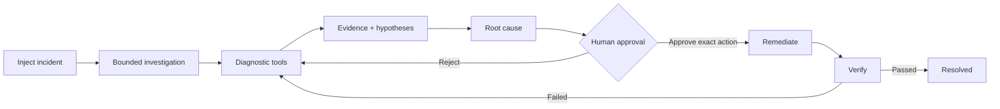
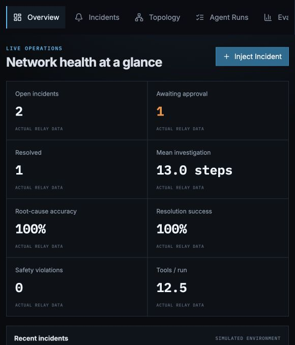
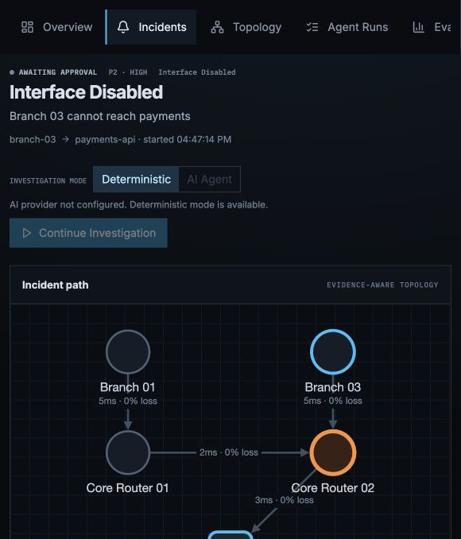
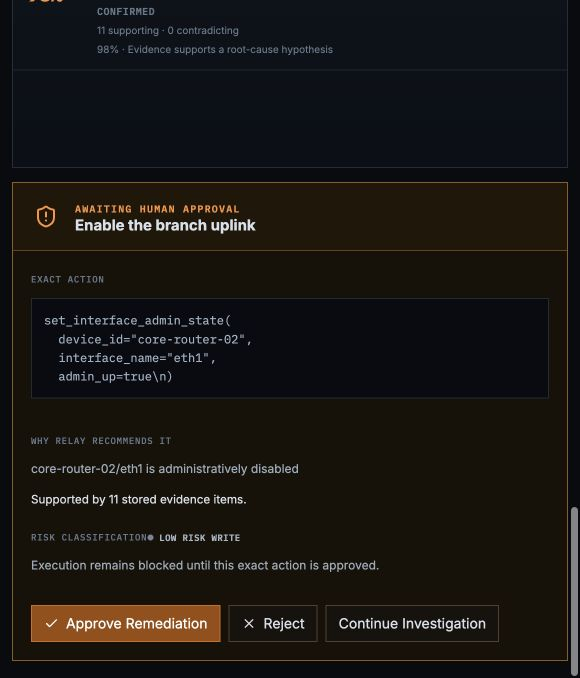
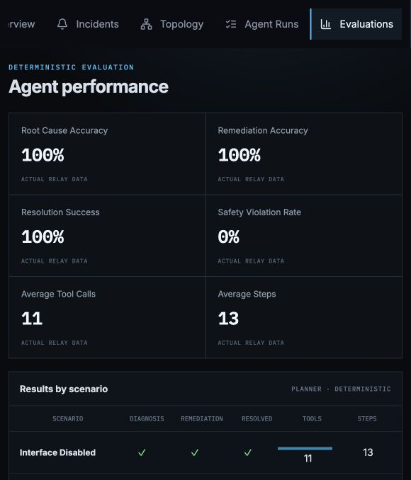
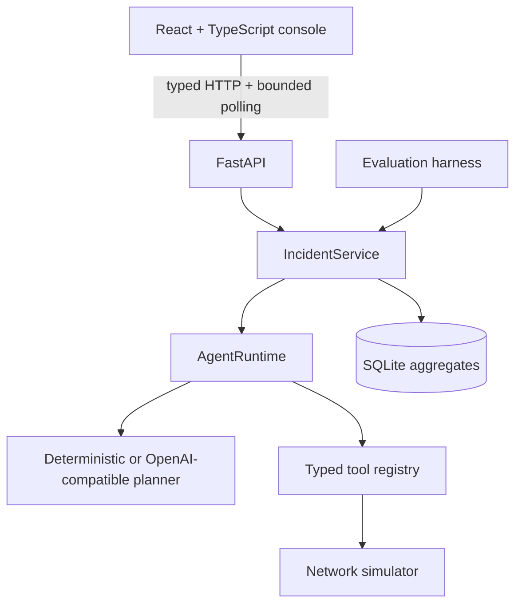

# Relay

> Relay is an agentic network incident response platform that autonomously investigates connectivity failures, gathers evidence through diagnostic tools, identifies root causes, proposes human-approved remediation, and verifies recovery.

Relay combines a deterministic network laboratory, bounded agent runtime, and interactive NOC console. Every structured plan, tool call, observation, hypothesis revision, approval, write, and recovery check is stored and visible.

## Problem and product workflow

Network incidents are diagnosed through reachability tests, path inspection, configuration checks, and human handoffs. An opaque AI answer is not operationally useful. Relay makes the investigation legible and keeps changes behind an exact-action approval boundary.



The console has real Overview, Incidents, Topology, Agent Runs, and Evaluations routes. The incident workspace combines the evidence-aware graph, chronological agent actions, expandable results, hypothesis history, approval controls, and verification state.

## Screenshots

These are captured from the running simulator-backed application.

| Overview | Active investigation |
| --- | --- |
|  |  |

| Human approval | Evaluations |
| --- | --- |
|  |  |

## Architecture



- `src/relay/domain`: incident, topology, evidence, hypothesis, run, approval, and verification models.
- `src/relay/network`: deterministic topology and six injected failures.
- `src/relay/tools`: validated tools with risk, retries, and approval enforcement.
- `src/relay/agent`: structured planner abstraction and bounded runtime.
- `src/relay/services`: orchestration, persistence, remediation, and verification.
- `frontend`: Vite, React, TypeScript, React Router, Cytoscape, and Vitest.

## Agent runtime and tools

The runtime receives a bounded `InvestigationContext`, requests one structured `AgentDecision`, validates it, executes only registered tools, records evidence, and maintains hypothesis revisions. It enforces a step budget and repeated-call limit. Hidden model chain-of-thought is never stored or shown.

Deterministic mode needs no external service. AI Agent mode uses an OpenAI-compatible Responses API adapter when configured; credentials stay backend-only and the UI disables this mode when unavailable.

Writes cannot execute without approval. A remediation stores the exact tool and arguments. Approval records a SHA-256 fingerprint over the incident, remediation, tool, and canonical arguments; Relay recomputes it immediately before execution. The UI never sends arbitrary tool calls.

## Network simulator

Relay models branch and core routers, a service, interfaces, routes, ACLs, configuration baselines, DNS, latency, and packet loss. Scenarios are Interface Disabled, Incorrect Static Route, ACL Blocking Application Traffic, DNS Failure, Congested Link, and Configuration Drift. Descriptions are shown to the user; expected root causes remain in the evaluation harness.

## Example investigation

```text
Capture bounded topology
Test IP reachability                       packet loss: 100%
Locate path failure                       stopped after branch-03
Inspect source route                      next hop: core-router-02
Inspect branch uplink                     eth1 admin_up=false
Test application service                  unreachable
Test service DNS                          payments-api
Inspect traffic policy                    no active deny
Inspect link health                       nominal
Measure packet loss                       100%
Check configuration drift                 mismatch found
Evidence supports root-cause hypothesis   confidence: 98% (heuristic)
Propose evidence-backed remediation       set_interface_admin_state(...)
```

Relay pauses in `AWAITING_APPROVAL`. Once the exact action is approved, it enables the interface, verifies ping and traceroute, and only then marks the incident `RESOLVED`.

## Evaluation

`evaluation-results.json` is generated by the harness, not hand-authored. Current deterministic results across all six scenarios are 100% root-cause accuracy, 100% remediation accuracy, 100% resolution success, 0% safety violations, 11 average diagnostic calls, 13 average steps, and 100% failed-tool recovery.

## Run with Docker

```bash
docker compose up --build
```

- Console: <http://localhost:5173>
- API: <http://localhost:8000>
- OpenAPI: <http://localhost:8000/docs>

An empty database receives three real simulator-backed examples (open, awaiting approval, resolved). Set `RELAY_SEED_DEMO_DATA=false` to disable this.

## Local development and tests

Python 3.12 and Node 22 with pnpm are recommended.

```bash
make install             # backend dependencies
make run                 # backend hot reload
make frontend-install
make frontend-run        # frontend hot reload

make check               # backend lint, format, types, tests
make eval
make frontend-test
make frontend-build
cd frontend && pnpm lint
```

Provider settings are documented in `.env.example`. The integration suite exercises the real simulator → investigation → approval → remediation → verification path. Frontend tests cover route chrome, topology ingestion, incident creation, expandable tool presentation, verification, errors, and evaluations.

## Demo

1. Open **Incidents** and inject **Interface Disabled**.
2. Choose **Deterministic** and start the investigation.
3. Expand tool calls and inspect evidence-linked topology and hypotheses.
4. Review and approve the exact remediation.
5. Watch recovery checks complete before `RESOLVED`.

## Known limitations and roadmap

- The simulator is intended for deterministic demonstrations, not concurrent production control.
- Short local runs use bounded polling; distributed workers should use a durable SSE event stream.
- The deterministic planner favors reproducibility over minimizing scenario-specific calls.
- Full workflow coverage is API integration plus component tests; Playwright is intentionally not added yet.
- Authentication, production integrations, and arbitrary shell execution are out of scope.

Milestone 4 should add queued execution, SSE delivery, cancellation, incident-scoped simulator sessions, and replayable event storage before authenticated, read-only production telemetry integrations.

## License

[MIT](LICENSE)
